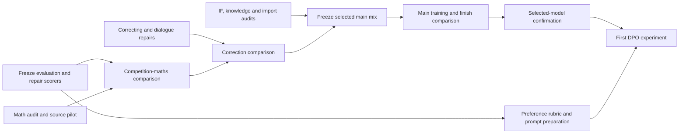

# Improving Greek Apertus before DPO

13 September 2026 · Owner-directed programme; initial parallel audits started. Later stages remain dependent on validated inputs and the existing budget.

**Current execution:** the [dataset audit and parallelism plan](execution/AUDIT_AND_PARALLELISM.md) defines which exact datasets are checked, sample sizes, whole-file versus semantic audits, Sol concurrency ramp, measured ETA method and stage dependencies. It incorporates the adaptation/correction prompt pack. Follow the [execution log](execution/EXECUTION_LOG.md) for actual work; the dated evidence below remains the planning baseline.

**First wave:** the 300-row maths audit has completed, alongside full-record dialogue, IF and import audits. Findings have already changed the next work: preserve full tool payloads; repair malformed maths notation and input-version tracking; check language edits against the original task; distinguish historical correction from a valid new user update. See the [execution results](execution/STATUS.md) for confirmed findings, provisional judgments and validation limits.

**Recommendation:** repair the measurements and data in parallel; run small, controlled maths and correction experiments; combine only accepted changes into one main SFT candidate; test its finishing stage explicitly; reach the first DPO experiment while September still has recovery time.

The objective remains better Greek capability than Krikri and Apertus-8B-Instruct, comparable capability to Apertus in English, French, German, Spanish, Portuguese and Italian, and better dialogue. Improving one pooled average is insufficient. SFT need not achieve the entire competitive objective before DPO begins.

All experiment names follow the adopted G/F/P registry. New dataset versions receive names when their manifests are frozen. Work-package labels below are descriptive tasks, not new experiment names.

## 1. What changes the plan

| Finding | Implication |
|---|---|
| Our dedicated English OpenMath block imports GSM8K only: 100,000 raw solutions, 7,417 distinct problem texts. In G3F2P1 it contributes 10.92% of supervised tokens. | Test competition-maths coverage before importing another large generic chat corpus. Preserve some elementary maths. |
| Greek MATH-500 fell from G2F1P0's 12.8% to G2F1P1--02's 7.6%; G3F2P1 scores 8.0%. | The decline predates the dedicated Greek maths addition. That addition is not an established cause. Finishing exposure, coverage and output behaviour need separate investigation. |
| Mixed-profile dialogue improved on some measures, but copying, stale state, false agreement and stopping remain problematic. The conversations were adaptive and unequal in count. | Freeze identical histories for diagnosis; use equally sized interactive panels for confirmation. |
| Our saved native GreekMMLU comparison favours G3F2P1, but its change over G2F1P1--02 is just seven correct answers. | Protect this capability and investigate individual domains; do not infer a useful MC-training recipe from the headline alone. |
| Published native GreekMMLU gives Krikri-Instruct a 66.47% zero-shot average; our saved item-weighted result is 52.01%. | Reconcile dataset identity, prompting, choice scoring and aggregation before strengthening the knowledge-superiority claim. These are not interchangeable scores. |
| Successful multilingual retention results exist, but a matched Apertus-Instruct comparison is missing from the inspected records. Several configured Greek tasks did not complete. | Complete the comparison and missing coverage before claiming foreign-language retention. |

The maths import finding is backed by the [saved coverage evidence](/Users/foivoskarounos-zamparloukos/Documents/Codex/2026-09-13/rea/outputs/competition_math/coverage_evidence.json). The new native GreekMMLU discrepancy is visible in the [published paper, Table 3](https://aclanthology.org/2026.findings-acl.448.pdf). It is an audit trigger, not evidence that either evaluation is necessarily wrong.

## 2. Evaluation: add coverage where decisions are currently blind

The [benchmark crosswalk](BENCHMARK_CROSSWALK.md) separates Krikri-Base, Krikri-Instruct, later evaluations and our own results. The highest-value changes are:

| Priority | Action | Decision it supports |
|---|---|---|
| First | Reconcile native GreekMMLU protocols; audit MATH answer extraction and Greek IFBench checkers; finish pivotal unjudged outputs. | Establish whether score changes reflect capability, output format or measurement. |
| First | Add Greek and English MT-Bench. | Measure broad two-turn dialogue on prompts also used to evaluate Krikri. |
| First | Activate Belebele in all seven target languages and complete Apertus's matched Global-MMLU-Lite evaluation. | Separate language comprehension from knowledge recognition and measure foreign-language retention against the intended peer. |
| First | Create a small frozen dialogue-state and factual-evidence panel. | Diagnose revision, inference, premise handling, factual recall and stopping with known answers. |
| Next | Add a 100-prompt Greek Arena-Hard pilot for the selected candidate and peers. | Assess open-ended usefulness beyond formal constraints; expand only if the pilot is informative. |
| Conditional | Add a small, balanced English BBH reasoning panel and a separately validated Greek adaptation if residual reasoning failures are poorly covered. | Diagnose non-mathematical reasoning without immediately adding a whole leaderboard battery. |

Keep MGSM, Greek/English MATH-500, native GreekMMLU, the eight native Greek benchmarks, IFEval, IFBench, XSTest, MultiChallenge and existing retention tasks. Report each capability and language separately. ASEP and medical MCQA already have coverage in the native suite; verify their exact source revisions rather than adding duplicates. XQuAD is already configured: finish it when its assets and task definition pass inspection.

Do not add full GPQA, MuSR, MMLU-Pro and every translated MMLU variant to every pilot. They are useful optional final diagnostics, but the current bottleneck is missing valid comparisons and targeted behavioural coverage.

### Frozen evaluation contract

- Keep the original Krikri and Apertus checkpoints pinned. Add **Krikri-Instruct-v1.5 to the small dialogue comparison**, without silently replacing the original peer. Its card reports improved MT-Bench alongside reduced IFEval, illustrating why those objectives need separate tracking. [Official variant card](https://huggingface.co/ilsp/Llama-Krikri-8B-Instruct-v1.5)
- Pin model revision, tokenizer, chat template, task revision, item IDs, prompts, decoding, scorer, judge and aggregation. Different models may need their native chat templates; the actual user task must remain equivalent.
- Use one fixed Sol judging configuration for new comparisons. Re-evaluate all compared models under it; do not rank our Sol scores against published GPT-4o or Sonnet scores. Blind model identity, balance answer order for pairwise judgments, retain ties and adjudicate pivotal disagreements with executable evidence or a human review.
- Keep mathematical correctness, explanation validity, extraction failures, loops, truncation, copied tails and ignored cancellation as separate fields. Test a longer generation limit only as a matched diagnostic; retain the existing protocol for historical comparisons.
- Separate training families, development families and final confirmation families before generating variants or translations. Existing public benchmarks have already informed development; call them regression/reference tests. Keep a new family-disjoint confirmation panel untouched until selection.
- Use paired item differences and uncertainty intervals. Resample whole conversations or problem families where observations are dependent. A small non-significant difference does not establish equivalence.

The crosswalk fixes initial item counts, model coverage and expansion rules. Pilot subsets are explicitly labelled as subsets, never as full benchmark scores.

## 3. Dataset changes

These changes address demonstrated coverage and target-quality issues. Their score effects remain hypotheses until tested.

The subsequent [generation/settings audit](GENERATION_SETTINGS_AUDIT.md) confirms that the first maths set already used Sol high for solving, whereas the unfinished worked-solution build defaults to medium. It also verifies a language-editing instruction conflict and unit-blind maths acceptance checks. Repair those contracts/checks before scaling; test high versus xhigh on difficult examples rather than assuming higher effort fixes the pipeline. Semantic repair and Greek correction require distinct acceptance criteria.

**Adaptation reference restored:** use the developed no_robots contract documented in [What adaptation means](ADAPTATION_REFERENCE.md). Preserve the training task while moving the cultural distribution, applying source-specific protections for maths, dialogue and foreign-language knowledge. The original Greek editor protects those decisions and repairs language only. Audit later prompts against that reference before replacing them or scaling; do not mistake the older absolute content-freeze summary for the final adopted rule. Benchmark translations retain a separate measurement contract.

The [task prompt pack](prompts/README.md) defines instructions for adaptation, Greek correction, maths, dialogue, knowledge/MC, IF/reasoning, semantic audit/repair, benchmark work and preference review. Use these definitions consistently: **correction** is language editing that preserves the adaptation; **semantic repair** fixes a demonstrated content defect. Audit and dialogue prompts have now been exercised in bounded Sol work; the remaining domain generation prompts still need their pilots. The [acceptance checks](prompts/DOMAIN_ACCEPTANCE.md) incorporate observed serialization, provenance, exact-output and state-update defects. No blanket production-quality claim follows from a successful pilot.

| Dataset area | Change now | Keep / defer |
|---|---|---|
| Competition maths | Audit 300 existing Greek candidate rows for solution correctness, premises, units and translation. Add original MATH-training problems from OpenMathInstruct-2, balanced by topic/difficulty and capped solutions per problem. Restore Level 5 coverage. | Keep GSM coverage. Inspect NuminaMath-1.5 as a supplement; defer bulk long/tool-dependent reasoning imports. |
| Greek maths targets | Preserve complete valid derivations and clear final answers; remove unsupported assumptions. Polish language with mathematical expressions protected, then recheck. Measure rendered lengths against the current 4,096-token training limit. | Do not equate “longer” or “boxed” with mathematically correct. Quarantine overlength examples instead of cutting off derivations. |
| Correcting | Replace unchanged correcting-v1 with a verified candidate set containing **600 labelled decisions: 200 false user claims, 200 true, 100 partly true, 100 unresolved**. Vary user confidence, tone and whether the assistant was previously wrong. | Keep useful misquotation cases after speaker-ownership checks. Test balanced data against no-correcting, with the rest fixed. |
| Conversation suite | Repair current rows, then add version editing, inference from remembered evidence, premise handling, and task cancellation. Use executable expected states wherever possible. | Retain natural conversation and immediate revision. Do not expand only argumentative or hostile dialogues. |
| Greek knowledge / MC | Prepare source-grounded training examples in three forms: short answer, MC with a brief valid explanation, and evidence-based QA. Balance subjects and answer positions; attach provenance and aliases. | Build a reviewed pilot, then scale only after the diagnostic shows whether recall, recognition or use of evidence is failing. Keep benchmark questions and their source families excluded. |
| Non-maths reasoning | Add fresh controlled examples of constraints, deduction, negation, quantifiers, counterfactuals and insufficient information, with computed solutions. | Retain reviewed reasoning/science imports. Do not train on translated BBH or other evaluation items. |
| Instruction following | Repair unsatisfiable constraints, literal-string mismatches and answers that obey formatting while failing the task. Rerun all checks after Greek polish. | Preserve a validated Greek/English core; keep IFBench's held-out constraint families out of training. |
| Safety and adequacy | Add independent safe-request scenarios with helpful substantive answers, plus appropriate boundaries for unsafe requests. | Preserve useful safety supervision. XSTest remains evaluation material. Measure helpfulness and appropriate refusal separately. |
| Personality and identity | Correct release facts and deployment-capability claims. Reduce repeated generic acknowledgements and gratuitous self-reference in targets. | Retain a small accurate identity/manners core; defer another repetition-factor sweep. |
| Imported chat, tools and languages | Audit the largest block, Nemotron chat, and quarantine verified broken schemas or unsupported claims in the complete rendered records. Track actual language and supervised-token shares. | Preserve explicit foreign-language coverage. A 44.55% token share makes Nemotron a useful later dose experiment; it does not establish harm or justify wholesale deletion. |

[OpenMathInstruct-2](https://huggingface.co/datasets/nvidia/OpenMathInstruct-2) provides original MATH as well as GSM and synthetic extensions. Start with reference-backed original training problems. [NuminaMath-1.5](https://huggingface.co/datasets/AI-MO/NuminaMath-1.5) supplies additional competition material with source/type metadata. The [earlier source shortlist](/Users/foivoskarounos-zamparloukos/Documents/Codex/2026-09-13/rea/outputs/competition_math/shortlist.md) records further Apertus and NVIDIA options.

For new capacity, first remove invalid rows and redundant repeated solutions. Within the dedicated English maths block, propose replacing **half its supervised-token budget** with competition maths for the screening experiment, retaining half for elementary maths. Hold the non-maths mix fixed. This is a test allocation, not an established optimum. Do not simultaneously cut generic chat, increase personality dose and add MC data in that experiment.

### Dialogue targets that should change concretely

1. **Revise the requested version accurately.** Store the original document, permitted edits and expected next version. Check protected spans exactly; a fluent rewrite that changes untouched content fails.
2. **Use conversation state to make the next decision.** Include purchases, revoked constraints, different people's commitments and derived availability. Require the correct decision and supporting evidence, not merely repetition of remembered names.
3. **Correct according to evidence.** Accept a valid correction, reject the false component of an invalid one, acknowledge a partially valid correction and remain uncertain when evidence is insufficient. Continue helping after disagreement. Handle explicitly fictional premises without treating them as factual errors.
4. **Complete the current request without replaying the conversation.** Teach relevant continuation, concise repair, topic changes and answers without copied previous tails. Supervise intended turns deliberately; do not repeatedly train on erroneous earlier assistant turns merely because they are context.
5. **Stop at the correct boundary.** Distinguish cancelling a task, requesting an exact output, and requesting silence. Verify EOS and serving behaviour separately from semantic compliance; define empty-answer behaviour at the application level before using it as a target.
6. **Maintain natural dialogue.** Include cooperative, brief, ambiguous and neutral users, appropriate clarification, topic development and varied response lengths. More apologies or confident disagreement are not substitutes for better answers.

## 4. Small experiments before the combined run

### Measurement and recovery

First reconcile scores using existing outputs. An identical-history panel can reuse only genuinely matching stored inputs. If such generations do not exist for a checkpoint, mark that cell missing and put new serving into the measurement budget. Do not call that recovery work “free” if it requires new generation or judging.

### Competition-coverage comparison

Run two short continuations from the **same pinned G2F1P0 checkpoint**, with the same LR, schedule, seed, updates, batch geometry and non-maths replay:

- Control: the existing elementary-maths allocation.
- Candidate: the proposed equal-token elementary/competition replacement within that allocation.

Price both manifests, match rendered training exposure as closely as possible, report supervised tokens and unique problem counts, and use identical maths formatting conventions. Keep any repaired Greek rows identical across both sides. This is a continuation screening test, not a reproduction of the full main-stage recipe. Its benefit must survive the later main run.

Primary readout: family-disjoint maths development accuracy by language/topic/difficulty. Safeguards: MGSM, termination, a compact dialogue panel and multilingual retention. A positive result attributable only to answer extraction is insufficient.

### Correction comparison

From the selected screening parent, compare balanced correcting data against a no-correcting control. Hold the conversation suite, personality dose and schedule fixed; specify equal-token neutral replay replacing the omitted correcting block. Keep all four truth categories visible in the readout. This comparison estimates that replacement's effect, not the value of correction training in every possible recipe.

**Proposed sequencing change:** the earlier worked-versus-terse × correcting four-way experiment remains unperformed. Prioritise the newly established competition-coverage gap, then the correction comparison. Keep worked-versus-terse on identical problems as a conditional follow-up. These sequential pairs do not estimate the original factorial interaction. Reconsider that interaction only if results require it and the budget permits; do not present the original experiment as completed.

### One selected main run and a measured finish

Freeze the reviewed mix and train from the same averaged CPT parent used for the main-stage comparisons. Include only data that passed its gates; an unfinished knowledge or dialogue block must not hold all other preparation indefinitely. Save the main-stage checkpoint, evaluate the compact panel, then try **one finishing epoch with explicit maths, IF and foreign-language retention slices**. Keep the pre-finish checkpoint if finishing harms the agreed capability profile.

The combined run tests the package. It does not retrospectively establish the contribution of every repaired dataset. MC-only training, personality dose, generic-chat reduction and extra seeds remain optional follow-ups rather than an automatic grid before DPO.

## 5. Parallel execution

CSCS had **no running or pending jobs for account a0140** in the read-only scheduler check at execution start. The first Sol audit wave has run with zero CSCS allocation. The following calendar windows remain targets; only the execution log and receipts establish completed or running work.

| Window | CSCS lane | Sol editing / data lane | Sol judging + analysis lane |
|---|---|---|---|
| 13–15 Sept | Small missing-peer/protocol measurements once manifests are ready | Maths audit and source pilot; correcting taxonomy; existing suite/IF repairs in parallel | Recover existing labels; scorer audit; GreekMMLU protocol comparison; freeze confirmation families |
| 15–18 Sept | Competition-coverage pair and targeted development checks | Build and check balanced correction + executable dialogue pilot; prepare grounded knowledge examples | Judge completed outputs; prepare per-language/readout tables |
| 18–21 Sept | Correction pair; then selected main run when its inputs are frozen | Polish and validate accepted blocks; prepare DPO rubric and independent prompt families | Read out maths/correction; calibrate preference judgments using existing outputs |
| 21–23 Sept | Finish comparison, selected-model battery and missing matched peer cells | Prepare preference prompts; resolve only candidate-blocking defects | Blind dialogue review, final SFT selection, acceptance/rejection analysis |
| 24–26 Sept | First DPO qualification, generation and bounded training | Fix data defects identified by the rating pilot | Preference labels and DPO comparison |
| 27–30 Sept | Recovery, final selected evaluation, checkpoint export | Documentation and release-data checks | Final evidence review |

These dates are targets, conditional on queues and measured throughput. **By 23 September, stop optional SFT ablations and decide whether the best validated candidate is ready for DPO.** If it is not, record the blocker rather than rushing unverified preference training. Confirm the grant's actual cutoff; September 30 is the owner's operational deadline.

Use one CSCS training allocation at a time initially, and overlap it with CPU preparation and Sol work. Simultaneous model serving is justified only with an explicit resource split and priced node-hours. Collect offline benchmark outputs in batches, release GPUs, then judge them. Reserve live judge capacity only for genuinely interactive dialogue.

The first wave used three Sol audit agents plus four maths workers, followed by eight maths workers alongside the agents: at most eleven task-level simultaneous Sol calls. The 300-row audit completed in 100 calls with no retries, in 11.3 minutes from the first probe call through the final response; its 96-call continuation took 7.6 minutes. Mean call duration was 37.5 seconds. Twelve workers remain an optional next-wave ceiling after quota and latency checks, not an achieved throughput measurement. The [active parallelism policy](execution/AUDIT_AND_PARALLELISM.md) governs the shared call budget. Jobs use stable row IDs, bounded retries, one writer per output shard and immutable input snapshots. Editors and reviewers receive separate contexts; using Sol twice is not independent truth verification. Arithmetic/state checkers and source-based review provide external checks.

The [Sol work packets](SOL_WORK_PACKETS.md) define inputs, outputs, caps and acceptance gates. Reuse and repair existing drivers; do not start duplicate workers after a detached-launch interruption. The inspected legacy maths driver requests 120 workers across two batches, above its recorded 100-call ceiling, and a scoring driver removes an existing score file. Both need correction before reuse.

## 6. Budget and stopping rules

The last owner-provided balance is **CHF 2,095.08 remaining**, not the original allocation. It is a September 13 screenshot, not a fresh authenticated portal balance. The separate cumulative SFT cap is CHF 230, with conservative estimated headroom of **CHF 65.46**. This plan changes neither.

Cost estimates use CHF 2.69 per GH200 node-hour. A node has four GPUs; count nodes × billable hours, including idle allocation time. CSCS fixes each project's rate at project start, so verify the project's actual rate before committing the envelope. [CSCS grant accounting](https://docs.cscs.ch/platforms/mlp/policies/), [published tariff](https://2go.cscs.ch/offering/swiss_academia/institutional_customers/)

| Work | Planning node-hours | Conservative CHF |
|---|---:|---:|
| Measurement/peer pilots, including new small panels | 2–4 | 10.76 |
| Competition-coverage pair, targeted checks included | 4–6 | 16.14 |
| Correction pair, targeted checks included | 3–4 | 10.76 |
| Selected main + finishing comparison | 11–14 | 37.66 |
| Selected full battery and missing matched peer cells | 6–10 | 26.90 |
| Shared retry/setup contingency | 4 reserved | 10.76 |
| **Total before DPO** | **26–38 work + 4 reserve** | **112.98** |

The first three rows total at most **14 node-hours / CHF 37.66**, which fits the current estimated SFT headroom. The full programme's **42-node-hour planning envelope exceeds that headroom by CHF 47.52**. The combined main run therefore requires a later explicit budget decision; it is not already funded by this plan. If measurement costs more than its allowance, reduce scope explicitly or reprice before launch, rather than omit peer checks silently.

Keep the previous **CHF 40–70 working expectation and CHF 150 proposed envelope for the first complete DPO experiment**, with CHF 500 as the wider proposed preference-work reserve. Those are unmeasured DPO planning figures, not existing commitments. First benchmark the actual pair lengths and implementation. Sol calls consume a separate account quota: track calls, input/output tokens, retries and remaining usage; do not call them free or convert them to CSCS credit.

Before each launch: freeze data/model IDs; count tokens, outputs, languages and turns; price training **and** evaluation; include existing commitments; check current queue/usage; obtain matching readiness/scheduler evidence using the canonical runner. Record the experiment-level maximum across retries. At 75% of an envelope, stop adding work and finish only already-budgeted critical tasks; do not kill a training allocation blindly or spend through the ceiling.

## 7. What counts as progress and readiness

- **Measurement:** pivotal scorer defects resolved; completed outputs distinguished from judged scores; peer protocols matched; uncertainty and exclusions visible.
- **Maths:** correct competition solutions improve on the prespecified development families, without gains consisting only of formatting changes. Track elementary retention and failures by difficulty, including Level 1 and Level 5.
- **Knowledge and languages:** reconcile native GreekMMLU first; retain full and clean-subset histories separately. Evaluate the same target languages against Apertus. Proposed review trigger: a ≥2 percentage-point point-estimate decline on an established retention endpoint prompts paired analysis and expansion where needed; this threshold is not a declaration of statistical equivalence.
- **Dialogue:** balanced correction, version preservation, state inference, usefulness and stopping improve on held-out scenarios. Use both frozen histories and equally sized mixed-profile interactive conversations. No overall dialogue average may conceal a correction or stop regression.
- **DPO readiness:** one reproducible SFT candidate, documented residual failures, calibrated preference labels, clean family splits and a priced DPO run. Keep chosen/rejected pairs about the same task and evidence; reject pairs where both answers are wrong. Track preference disagreement and length bias.

Prefer the simplest candidate whose improvements survive these checks. If an optional dataset is not ready, omit it explicitly from this iteration and record the deferred hypothesis. Preserve enough time and budget to learn from the first DPO result.

### Evidence and execution status

This plan uses the previously reconciled local results/receipts, the six dataset reviews, the adopted name registry, inspection of the evaluation configuration and successful result files, official papers/model cards, a fresh CSCS probe, and the first executed audit wave. Targeted review samples are not whole-corpus defect-rate estimates. The maths sample is stratified over completed partial outputs and its model flags require adjudication. Missing result cells remain missing. Sol audits and a 12-dialogue authoring pilot have run; no new model training, corpus-scale generation or cap increase has occurred.
