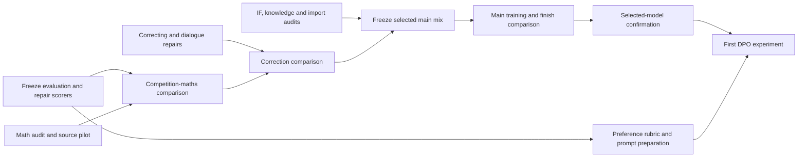

# Improving Greek Apertus before DPO

13 September 2026 · Active goal; second-wave audits and repair pilots executed. Later stages depend on validated inputs and the existing budget.

**Active goal:** [GOAL.md](GOAL.md) strengthens the objective to fair superiority over the strongest verified Krikri release(s), all-round benchmarks and dialogue, high-quality Greek, and transparent release materials. The goal is active and execution continues. [DECISIONS.md](DECISIONS.md) records the result-driven changes; update this plan after each new result. The existing foreign-language retention objective and budget remain in force.

**Current execution:** the [dataset audit and parallelism plan](execution/AUDIT_AND_PARALLELISM.md) defines which exact datasets are checked, sample sizes, whole-file versus semantic audits, Sol concurrency ramp, measured ETA method and stage dependencies. It incorporates the adaptation/correction prompt pack. Follow the [execution log](execution/EXECUTION_LOG.md) for actual work; the dated evidence below remains the planning baseline.

**First wave:** the 300-row maths audit has completed, alongside full-record dialogue, IF and import audits. Findings have already changed the next work: preserve full tool payloads; repair malformed maths notation and input-version tracking; check language edits against the original task; distinguish historical correction from a valid new user update. See the [execution results](execution/STATUS.md) for confirmed findings, provisional judgments and validation limits.

**Second-wave changes:** [adapted-core findings](execution/wave2/adapted_core/report.md) support retention plus targeted repairs. [IF repair pilot](execution/wave2/instruction_following/report.md) demonstrates that checker passes can coexist with task failure; its [root revision](execution/wave2/instruction_following/v2/receipt.json) resolves the training lexical protocol explicitly and identified four cases for source verification; the [independently reviewed version](execution/wave2/instruction_following/v4/receipt.json) now has 20 accepted candidates with checker passes and source-supported repairs. The [fair-peer audit](execution/wave2/fairness_and_release/FAIRNESS_AND_RELEASE_REPORT.md) pins both Krikri releases. The trained-maths review has all 122 rows returned; adjudication and independent review have accepted seven bounded repair candidates. The [personality audit](execution/wave2/personality/report.md) is complete: repair deployment claims and restore six missing closures, while noting all six malformed rows were excluded from actual training. The maths-generation pilot completed 88 successful calls (92 attempts including four schema rejections); all 32 problems have now received semantic review. Eight defective reused solutions are rebuilt, eight sound controls retained, and the 16 fresh Level 5 problems include two explicit source-question repairs. The final 32-row package is assembled, with exact token/mask measurements and zero invalid control characters in selected text; the sixteen fresh Greek-language checks are complete, with valid original text retained after reviewing four optional editor proposals. A four-dialogue probe passed transport checks but failed the semantic gate: unsupported prior facts and a leaked answer changed the intended task. Its revised visible-evidence and action contracts passed the four-dialogue repair probe; all 32 training decisions are now semantically and linguistically accepted, with actual training-reader, tokenization and target-mask checks. Four scope repairs and four language edits are preserved as explicit deltas; development/final generation remains separate. The four root personality corrections passed independent review;42candidates remain staged for a new assembly. The first bounded CSCS comparison, job3390957, saved all3,717 generations then failed during terminal-table formatting; CPU recovery of saved scores is complete. Its accounting receipt confirms22m17s/0.3713889node-hours/CHF0.9990. Recovered MATH scores remain historical-protocol diagnostics pending the scorer repair described below.

**Recommendation:** repair the measurements and data in parallel; run small, controlled maths and correction experiments; combine only accepted changes into one main SFT candidate; test its finishing stage explicitly; reach the first DPO experiment while September still has recovery time.

The objective remains better Greek capability than Krikri and Apertus-8B-Instruct, comparable capability to Apertus in English, French, German, Spanish, Portuguese and Italian, and better dialogue. Improving one pooled average is insufficient. The current goal targets a competitive SFT mix. DPO remains the next separate experiment; it must not be used to claim that an unmeasured or underperforming SFT mix has met this goal.

All experiment names follow the adopted G/F/P registry. New dataset versions receive names when their manifests are frozen. Work-package labels below are descriptive tasks, not new experiment names.

## 1. What changes the plan

| Finding | Implication |
|---|---|
| Our dedicated English OpenMath block imports GSM8K only: 100,000 raw solutions, 7,417 distinct problem texts. In G3F2P1 it contributes 10.92% of supervised tokens. | Test competition-maths coverage before importing another large generic chat corpus. Preserve some elementary maths. |
| Greek MATH-500 fell from G2F1P0's 12.8% to G2F1P1--02's 7.6%; G3F2P1 scores 8.0%. | The decline predates the dedicated Greek maths addition. That addition is not an established cause. Finishing exposure, coverage and output behaviour need separate investigation. |
| Mixed-profile dialogue improved on some measures, but copying, stale state, false agreement and stopping remain problematic. The conversations were adaptive and unequal in count. | Freeze identical histories for diagnosis; use equally sized interactive panels for confirmation. |
| Our saved native GreekMMLU comparison favours G3F2P1, but its change over G2F1P1--02 is just seven correct answers. | Protect this capability and investigate individual domains; do not infer a useful MC-training recipe from the headline alone. |
| Published native GreekMMLU gives Krikri-Instruct a 66.47% zero-shot average; our saved item-weighted result is 52.01%. | The code audit now confirms distinct protocols: our score uses average full-answer likelihood; official code scores Greek labels under a subject-specific prompt. Reaggregation gives 53.62%, so a matched 200-item diagnostic is required before knowledge-superiority claims. See execution/wave2/greekmmlu_protocol/report.md. |
| Successful multilingual retention results exist, but a matched Apertus-Instruct comparison is missing from the inspected records. Several configured Greek tasks did not complete. | Complete the comparison and missing coverage before claiming foreign-language retention. |

The maths import finding is backed by the [saved coverage evidence](/Users/foivoskarounos-zamparloukos/Documents/Codex/2026-09-13/rea/outputs/competition_math/coverage_evidence.json). The new native GreekMMLU discrepancy is visible in the [published paper, Table 3](https://aclanthology.org/2026.findings-acl.448.pdf). It is an audit trigger, not evidence that either evaluation is necessarily wrong.

## 2. Evaluation: add coverage where decisions are currently blind

The [benchmark crosswalk](BENCHMARK_CROSSWALK.md) separates Krikri-Base, Krikri-Instruct, later evaluations and our own results. The highest-value changes are:

| Priority | Action | Decision it supports |
|---|---|---|
| First | Reconcile native GreekMMLU protocols; audit MATH answer extraction and Greek IFBench checkers; finish pivotal unjudged outputs. | Establish whether score changes reflect capability, output format or measurement. |
| First | Add Greek and English MT-Bench. | Measure broad two-turn dialogue on prompts also used to evaluate Krikri. |
| First | Activate Belebele in all seven target languages and complete Apertus's matched Global-MMLU-Lite evaluation. | Separate language comprehension from knowledge recognition and measure foreign-language retention against the intended peer. |
| First | Create a small frozen dialogue-state and factual-evidence panel. | Diagnose revision, inference, premise handling, factual recall and stopping with known answers. |
| Next | Add a 100-prompt Greek Arena-Hard pilot for the selected candidate and peers. | Assess open-ended usefulness beyond formal constraints; expand only if the pilot is informative. |
| Conditional | Add a small, balanced English BBH reasoning panel and a separately validated Greek adaptation if residual reasoning failures are poorly covered. | Diagnose non-mathematical reasoning without immediately adding a whole leaderboard battery. |

Keep MGSM, Greek/English MATH-500, native GreekMMLU, the eight native Greek benchmarks, IFEval, IFBench, XSTest, MultiChallenge and existing retention tasks. Report each capability and language separately. ASEP and medical MCQA already have coverage in the native suite; verify their exact source revisions rather than adding duplicates. XQuAD is already configured: finish it when its assets and task definition pass inspection.

Do not add full GPQA, MuSR, MMLU-Pro and every translated MMLU variant to every pilot. They are useful optional final diagnostics, but the current bottleneck is missing valid comparisons and targeted behavioural coverage.

### Immediate scoring repair

Root reproduced incorrect equality of distinct categorical answers in the frozen MATH scorer and missed English final-answer phrases. Preserve historical numbers, including v1.5's38.2%Greek/40.8%English, but do not use them as settled rankings. The new scoring version must preserve categorical meanings, extract explicit answer phrases correctly, and handle separator ambiguity explicitly; run meaningful regression examples and apply the same version to all compared saved outputs. Report extraction failures and scorer-only score changes separately from model improvements. Keep original scorer artifacts unchanged. Full XSTest/MultiChallenge judging remains pending after this critical measurement fix.

### Frozen evaluation contract

- Keep the original Krikri and Apertus checkpoints pinned. Add **Krikri-Instruct-v1.5 as a full fair peer**, without replacing the original peer. Both releases remain separately reported across the critical endpoints; do not create a per-item hybrid peer. Its card reports improved MT-Bench alongside reduced IFEval, illustrating why those objectives need separate tracking. [Official variant card](https://huggingface.co/ilsp/Llama-Krikri-8B-Instruct-v1.5)
- Pin model revision, tokenizer, chat template, task revision, item IDs, prompts, decoding, scorer, judge and aggregation. Different models may need their native chat templates; the actual user task must remain equivalent.
- Use one fixed Sol judging configuration for new comparisons. Re-evaluate all compared models under it; do not rank our Sol scores against published GPT-4o or Sonnet scores. Blind model identity, balance answer order for pairwise judgments, retain ties and adjudicate pivotal disagreements with executable evidence or a human review.
- Keep mathematical correctness, explanation validity, extraction failures, loops, truncation, copied tails and ignored cancellation as separate fields. Test a longer generation limit only as a matched diagnostic; retain the existing protocol for historical comparisons.
- Separate training families, development families and final confirmation families before generating variants or translations. Existing public benchmarks have already informed development; call them regression/reference tests. Keep a new family-disjoint confirmation panel untouched until selection.
- Use paired item differences and uncertainty intervals. Resample whole conversations or problem families where observations are dependent. A small non-significant difference does not establish equivalence.

The crosswalk fixes initial item counts, model coverage and expansion rules. Pilot subsets are explicitly labelled as subsets, never as full benchmark scores.

## 3. Dataset changes

**Updated repair strategy:** preserve sound existing adaptations and fix local defects. Re-adapt from the original only when cultural/task adaptation failed; regenerate solutions from valid problems when the defect is in the derivation; rebuild unreliable scenario families or input-version pairings. The tool block needs a new source export. The second wave has inspected 24 complete Greek core pairs (23 keep, one local repair), 18 paired EN/FR/DE records (17 keep, one local repair), and nine separate unpaired ES/PT/IT records. These bounded reads support retaining the adapted core with targeted repairs. Two raw-comparison assembly rows have lineage drift and must not support a controlled causal comparison until resolved. The 122-row trained-maths review and adjudication are complete: seven repair candidates passed independent review; no editor-introduced damage was observed, but inherited defects remain. These counts are not whole-corpus defect rates. A new generation pass is not automatically higher quality than a repair.

These changes address demonstrated coverage and target-quality issues. Their score effects remain hypotheses until tested.

The subsequent [generation/settings audit](GENERATION_SETTINGS_AUDIT.md) confirms that the first maths set already used Sol high for solving, whereas the unfinished worked-solution build defaults to medium. It also verifies a language-editing instruction conflict and unit-blind maths acceptance checks. Repair those contracts/checks before scaling; test high versus xhigh on difficult examples rather than assuming higher effort fixes the pipeline. Semantic repair and Greek correction require distinct acceptance criteria.

**Adaptation reference restored:** use the developed no_robots contract documented in [What adaptation means](ADAPTATION_REFERENCE.md). Preserve the training task while moving the cultural distribution, applying source-specific protections for maths, dialogue and foreign-language knowledge. The original Greek editor protects those decisions and repairs language only. Audit later prompts against that reference before replacing them or scaling; do not mistake the older absolute content-freeze summary for the final adopted rule. Benchmark translations retain a separate measurement contract.

The [task prompt pack](prompts/README.md) defines instructions for adaptation, Greek correction, maths, dialogue, knowledge/MC, IF/reasoning, semantic audit/repair, benchmark work and preference review. Use these definitions consistently: **correction** is language editing that preserves the adaptation; **semantic repair** fixes a demonstrated content defect. Audit and dialogue prompts have now been exercised in bounded Sol work; the remaining domain generation prompts still need their pilots. The [acceptance checks](prompts/DOMAIN_ACCEPTANCE.md) incorporate observed serialization, provenance, exact-output and state-update defects. No blanket production-quality claim follows from a successful pilot.

| Dataset area | Change now | Keep / defer |
|---|---|---|
| Competition maths | The 300-row audit is complete; adjudicated defects and provenance failures now route repair or reconstruction. The 32-problem pilot has completed adaptation, blind solving and full review; finish candidate assembly and actual-tokenizer length/decontamination checks before scaling. Two flawed source questions need declared semantic repair, and one high-effort output contained an invalid control character. Add original MATH-training problems from OpenMathInstruct-2, balanced by topic/difficulty and capped solutions per problem. Restore Level 5 coverage. | Keep GSM coverage. Inspect NuminaMath-1.5 as a supplement; defer bulk long/tool-dependent reasoning imports. |
| Greek maths targets | Preserve complete valid derivations and clear final answers; remove unsupported assumptions. Polish language with mathematical expressions protected, then recheck. Measure rendered lengths against the current 4,096-token training limit. | Do not equate “longer” or “boxed” with mathematically correct. Quarantine overlength examples instead of cutting off derivations. |
| Correcting | Replace unchanged correcting-v1 with a verified candidate set containing **600 training decisions: 200 false user claims, 200 true, 100 partly true, 100 unresolved**, plus 60 development and 60 final-confirmation decisions in separate families. Vary user confidence, tone and whether the assistant was previously wrong. | Keep useful misquotation cases after speaker-ownership checks. Test balanced data against no-correcting, with the rest fixed. |
| Conversation suite | Repair current rows, then add version editing, inference from remembered evidence, premise handling, and task cancellation. Use executable expected states grounded only in evidence visible to the model. Preserve the exact user decision semantics; distinguish an inference about history from new user-supplied information. Keep text-record edits separate from tool-backed external actions. | Retain natural conversation and immediate revision. Do not expand only argumentative or hostile dialogues. |
| Greek knowledge / MC | Prepare source-grounded training examples in three forms: short answer, MC with a brief valid explanation, and evidence-based QA. Balance subjects and answer positions; attach provenance and aliases. | Build a reviewed pilot, then scale only after the diagnostic shows whether recall, recognition or use of evidence is failing. Keep benchmark questions and their source families excluded. |
| Non-maths reasoning | Add fresh controlled examples of constraints, deduction, negation, quantifiers, counterfactuals and insufficient information, with computed solutions. | Retain reviewed reasoning/science imports. Do not train on translated BBH or other evaluation items. |
| Instruction following | Repair unsatisfiable constraints, literal-string mismatches and answers that obey formatting while failing the task. Rerun all checks after Greek polish. | Preserve a validated Greek/English core; keep IFBench's held-out constraint families out of training. |
| Safety and adequacy | Add independent safe-request scenarios with helpful substantive answers, plus appropriate boundaries for unsafe requests. | Preserve useful safety supervision. XSTest remains evaluation material. Measure helpfulness and appropriate refusal separately. |
| Personality and identity | Correct release facts and deployment-capability claims while preserving conversation relevance and speaker relationships. Do not replace ordinary farewells with deployment disclaimers. Reduce repeated generic acknowledgements and gratuitous self-reference in targets. | Retain a small accurate identity/manners core; defer another repetition-factor sweep. |
| Imported chat, tools and languages | Audit the largest block, Nemotron chat, and quarantine verified broken schemas or unsupported claims in the complete rendered records. Track actual language and supervised-token shares. | Preserve explicit foreign-language coverage. A 44.55% token share makes Nemotron a useful later dose experiment; it does not establish harm or justify wholesale deletion. |

[OpenMathInstruct-2](https://huggingface.co/datasets/nvidia/OpenMathInstruct-2) provides original MATH as well as GSM and synthetic extensions. Start with reference-backed original training problems. [NuminaMath-1.5](https://huggingface.co/datasets/AI-MO/NuminaMath-1.5) supplies additional competition material with source/type metadata. The [earlier source shortlist](/Users/foivoskarounos-zamparloukos/Documents/Codex/2026-09-13/rea/outputs/competition_math/shortlist.md) records further Apertus and NVIDIA options.

For new capacity, first remove invalid rows and redundant repeated solutions. Within the dedicated English maths block, propose replacing **half its supervised-token budget** with competition maths for the screening experiment, retaining half for elementary maths. Hold the non-maths mix fixed. This is a test allocation, not an established optimum. Do not simultaneously cut generic chat, increase personality dose and add MC data in that experiment.

### Current bounded scaling decisions

The [complete maths family inventory](execution/wave2/maths_scale_preparation/report.md) freezes 35 first-stage training families, 70 optional second-stage families, 14 development families and 14 final-confirmation families after known-training and benchmark exclusions. Seven old-pair reviews and the14-source **training-only** probe are complete at56 actual model calls; the accepted21-row package passed Greek and actual token/mask checks. The unchanged72-call stage ceiling comprised: 42 primary (adapt, solve, blind verify), up to 14 Greek checks, eight concrete source/solution repairs and eight retries. **High is the default; extra-high is defect-triggered only.** This supersedes the inventory report's illustrative half-xhigh schedule. Final-confirmation content stays outside prompt development and selection. The 14-family final panel is a bounded quality check, not sufficient evidence for broad benchmark superiority.

The [32 accepted training dialogues](execution/wave2/balanced_dialogue_pilot/revision2/accepted_train32/REPORT.md) pass semantic, language and actual training-mask checks. Generate the eight development decisions under frozen contracts next; inspect them before scaling the 600-row training block. Source review found further development-only scope defects; repair and bind them before authoring. The seven usable final decisions remain sealed until prompt/gate freeze; one silence case remains quarantined pending the serving contract. Track cumulative calls rather than resetting budgets at each directory.

A further20 distinct TRAIN scenario families (60decisions) are being specified with executable state/action checks before broader dialogue authoring. Independent Dolci200 and one-shard OpenMath CPU pilots are being prepared at no more thanone30-minute allocation each (CHF1.35planningmaximumeach); they are not yet launched.

### Dialogue targets that should change concretely

1. **Revise the requested version accurately.** Store the original document, permitted edits and expected next version. Check protected spans exactly; a fluent rewrite that changes untouched content fails.
2. **Use conversation state to make the next decision.** Include purchases, revoked constraints, different people's commitments and derived availability. Require the correct decision and supporting evidence, not merely repetition of remembered names.
3. **Correct according to evidence.** Accept a valid correction, reject the false component of an invalid one, acknowledge a partially valid correction and remain uncertain when evidence is insufficient. Continue helping after disagreement. Handle explicitly fictional premises without treating them as factual errors.
4. **Complete the current request without replaying the conversation.** Teach relevant continuation, concise repair, topic changes and answers without copied previous tails. Supervise intended turns deliberately; do not repeatedly train on erroneous earlier assistant turns merely because they are context.
5. **Stop at the correct boundary.** Distinguish cancelling a task, requesting an exact output, and requesting silence. Verify EOS and serving behaviour separately from semantic compliance; define empty-answer behaviour at the application level before using it as a target.
6. **Maintain natural dialogue.** Include cooperative, brief, ambiguous and neutral users, appropriate clarification, topic development and varied response lengths. More apologies or confident disagreement are not substitutes for better answers.

## 4. Small experiments before the combined run

### Measurement and recovery

First reconcile scores using existing outputs. An identical-history panel can reuse only genuinely matching stored inputs. If such generations do not exist for a checkpoint, mark that cell missing and put new serving into the measurement budget. Do not call that recovery work “free” if it requires new generation or judging.

### Competition-coverage comparison

Run two short continuations from the **same pinned G2F1P0 checkpoint**, with the same LR, schedule, seed, updates, batch geometry and non-maths replay:

- Control: the existing elementary-maths allocation.
- Candidate: the proposed equal-token elementary/competition replacement within that allocation.

Price both manifests, match rendered training exposure as closely as possible, report supervised tokens and unique problem counts, and use identical maths formatting conventions. Keep any repaired Greek rows identical across both sides. This is a continuation screening test, not a reproduction of the full main-stage recipe. Its benefit must survive the later main run.

Primary readout: family-disjoint maths development accuracy by language/topic/difficulty. Safeguards: MGSM, termination, a compact dialogue panel and multilingual retention. A positive result attributable only to answer extraction is insufficient.

### Correction comparison

From the selected screening parent, compare balanced correcting data against a no-correcting control. Hold the conversation suite, personality dose and schedule fixed; specify equal-token neutral replay replacing the omitted correcting block. Keep all four truth categories visible in the readout. This comparison estimates that replacement's effect, not the value of correction training in every possible recipe.

**Proposed sequencing change:** the earlier worked-versus-terse × correcting four-way experiment remains unperformed. Prioritise the newly established competition-coverage gap, then the correction comparison. Keep worked-versus-terse on identical problems as a conditional follow-up. These sequential pairs do not estimate the original factorial interaction. Reconsider that interaction only if results require it and the budget permits; do not present the original experiment as completed.

### One selected main run and a measured finish

Freeze the reviewed mix and train from the same averaged CPT parent used for the main-stage comparisons. Include only data that passed its gates; an unfinished knowledge or dialogue block must not hold all other preparation indefinitely. Save the main-stage checkpoint, evaluate the compact panel, then try **one finishing epoch with explicit maths, IF and foreign-language retention slices**. Keep the pre-finish checkpoint if finishing harms the agreed capability profile.

The combined run tests the package. It does not retrospectively establish the contribution of every repaired dataset. MC-only training, personality dose, generic-chat reduction and extra seeds remain optional follow-ups rather than an automatic grid before DPO.

## 5. Parallel execution

CSCS had **no running or pending jobs for account a0140** in the read-only scheduler check at execution start. Job3390957 completed inference on one debug node and failed during result-table formatting; its reviewed maximum was85minutes (maximum 1.4167 node-hours / CHF 3.81) inside the existing four-node-hour measurement envelope. The context-limited MultiChallenge run is a 213-item diagnostic with 49 recorded exclusions, not a full 262-item result; compared historical outputs must be reaggregated on exactly shared IDs. Full matched context coverage remains a separate gate. The first Sol audit wave has run with zero CSCS allocation. The following calendar windows remain targets; only the execution log and receipts establish completed or running work.

| Window | CSCS lane | Sol editing / data lane | Sol judging + analysis lane |
|---|---|---|---|
| 13–15 Sept | Small missing-peer/protocol measurements once manifests are ready | Maths audit and source pilot; correcting taxonomy; existing suite/IF repairs in parallel | Recover existing labels; scorer audit; GreekMMLU protocol comparison; freeze confirmation families |
| 15–18 Sept | Competition-coverage pair and targeted development checks | Build and check balanced correction + executable dialogue pilot; prepare grounded knowledge examples | Judge completed outputs; prepare per-language/readout tables |
| 18–21 Sept | Correction pair; then selected main run when its inputs are frozen | Polish and validate accepted blocks; prepare DPO rubric and independent prompt families | Read out maths/correction; calibrate preference judgments using existing outputs |
| 21–23 Sept | Finish comparison, selected-model battery and missing matched peer cells | Prepare preference prompts; resolve only candidate-blocking defects | Blind dialogue review, final SFT selection, acceptance/rejection analysis |
| 24–26 Sept | First DPO qualification, generation and bounded training | Fix data defects identified by the rating pilot | Preference labels and DPO comparison |
| 27–30 Sept | Recovery, final selected evaluation, checkpoint export | Documentation and release-data checks | Final evidence review |

These dates are targets, conditional on queues and measured throughput. **By 23 September, stop optional SFT ablations and decide whether the best validated candidate is ready for DPO.** If it is not, record the blocker rather than rushing unverified preference training. Confirm the grant's actual cutoff; September 30 is the owner's operational deadline.

Use one CSCS training allocation at a time initially, and overlap it with CPU preparation and Sol work. Simultaneous model serving is justified only with an explicit resource split and priced node-hours. Collect offline benchmark outputs in batches, release GPUs, then judge them. Reserve live judge capacity only for genuinely interactive dialogue.

The first wave used three Sol audit agents plus four maths workers, followed by eight maths workers alongside the agents: at most eleven task-level simultaneous Sol calls. The 300-row audit completed in 100 calls with no retries, in 11.3 minutes from the first probe call through the final response; its 96-call continuation took 7.6 minutes. Mean call duration was 37.5 seconds. Twelve workers remain an optional next-wave ceiling after quota and latency checks, not an achieved throughput measurement. The [active parallelism policy](execution/AUDIT_AND_PARALLELISM.md) governs the shared call budget. Jobs use stable row IDs, bounded retries, one writer per output shard and immutable input snapshots. Editors and reviewers receive separate contexts; using Sol twice is not independent truth verification. Arithmetic/state checkers and source-based review provide external checks.

The [Sol work packets](SOL_WORK_PACKETS.md) define inputs, outputs, caps and acceptance gates. Reuse and repair existing drivers; do not start duplicate workers after a detached-launch interruption. The inspected legacy maths driver requests 120 workers across two batches, above its recorded 100-call ceiling, and a scoring driver removes an existing score file. Both need correction before reuse.

## 6. Budget and stopping rules

The last owner-provided balance is **CHF 2,095.08 remaining**, not the original allocation. It is a September 13 screenshot, not a fresh authenticated portal balance. The separate cumulative SFT cap is CHF 230, with reconciled ledger headroom of **CHF 65.98** (60.9734 node-hours / CHF 164.0190 planning usage). This plan changes neither.

Cost estimates use CHF 2.69 per GH200 node-hour. A node has four GPUs; count nodes × billable hours, including idle allocation time. CSCS fixes each project's rate at project start, so verify the project's actual rate before committing the envelope. [CSCS grant accounting](https://docs.cscs.ch/platforms/mlp/policies/), [published tariff](https://2go.cscs.ch/offering/swiss_academia/institutional_customers/)

| Work | Planning node-hours | Conservative CHF |
|---|---:|---:|
| Measurement/peer pilots, including new small panels | 2–4 | 10.76 |
| Competition-coverage pair, targeted checks included | 4–6 | 16.14 |
| Correction pair, targeted checks included | 3–4 | 10.76 |
| Selected main + finishing comparison | 11–14 | 37.66 |
| Selected full battery and missing matched peer cells | 6–10 | 26.90 |
| Shared retry/setup contingency | 4 reserved | 10.76 |
| **Total before DPO** | **26–38 work + 4 reserve** | **112.98** |

The first three rows total at most **14 node-hours / CHF 37.66**, which fits the current estimated SFT headroom. The full programme's **42-node-hour planning envelope exceeds that headroom by CHF 46.00**. The combined main run therefore requires a later explicit budget decision; it is not already funded by this plan. If measurement costs more than its allowance, reduce scope explicitly or reprice before launch, rather than omit peer checks silently.

Keep the previous **CHF 40–70 working expectation and CHF 150 proposed envelope for the first complete DPO experiment**, with CHF 500 as the wider proposed preference-work reserve. Those are unmeasured DPO planning figures, not existing commitments. First benchmark the actual pair lengths and implementation. Sol calls consume a separate account quota: track calls, input/output tokens, retries and remaining usage; do not call them free or convert them to CSCS credit.

Before each launch: freeze data/model IDs; count tokens, outputs, languages and turns; price training **and** evaluation; include existing commitments; check current queue/usage; obtain matching readiness/scheduler evidence using the canonical runner. Record the experiment-level maximum across retries. At 75% of an envelope, stop adding work and finish only already-budgeted critical tasks; do not kill a training allocation blindly or spend through the ceiling.

## 7. What counts as progress and readiness

- **Measurement:** pivotal scorer defects resolved; completed outputs distinguished from judged scores; peer protocols matched; uncertainty and exclusions visible.
- **Maths:** correct competition solutions improve on the prespecified development families, without gains consisting only of formatting changes. Track elementary retention and failures by difficulty, including Level 1 and Level 5.
- **Knowledge and languages:** reconcile native GreekMMLU first; retain full and clean-subset histories separately. Evaluate the same target languages against Apertus. Proposed review trigger: a ≥2 percentage-point point-estimate decline on an established retention endpoint prompts paired analysis and expansion where needed; this threshold is not a declaration of statistical equivalence.
- **Dialogue:** balanced correction, version preservation, state inference, usefulness and stopping improve on held-out scenarios. Use both frozen histories and equally sized mixed-profile interactive conversations. No overall dialogue average may conceal a correction or stop regression.
- **DPO readiness:** one reproducible SFT candidate, documented residual failures, calibrated preference labels, clean family splits and a priced DPO run. Keep chosen/rejected pairs about the same task and evidence; reject pairs where both answers are wrong. Track preference disagreement and length bias.

Prefer the simplest candidate whose improvements survive these checks. If an optional dataset is not ready, omit it explicitly from this iteration and record the deferred hypothesis. Preserve enough time and budget to learn from the first DPO result.

### Evidence and execution status

This plan uses the previously reconciled local results/receipts, the six dataset reviews, the adopted name registry, inspection of the evaluation configuration and successful result files, official papers/model cards, fresh CSCS probes, and the two executed audit waves. Targeted review samples are not whole-corpus defect-rate estimates. The maths sample is stratified over completed partial outputs and its model flags require adjudication. Missing result cells remain missing. Sol audits, a 12-dialogue authoring pilot, twenty IF repair candidates, seven trained-maths repair candidates, a complete 32-problem generation pilot and a completed 32-decision training dialogue pilot have run. The original four-dialogue probe failed semantic acceptance; revised contracts and four later scope repairs now pass, and the Greek-reviewed training projection has passed actual reader/token/mask checks. No new model training, corpus-scale generation or cap increase has occurred.

## D018 — consolidate candidates, complete development checks, challenge scorer assumptions

The eight development dialogues passed full semantic and Greek review and the actual reader/tokenizer/mask checks: 1,176 input tokens, 264 supervised tokens, maximum 183. Six Greek checks returned unchanged and two optional wording proposals were declined. Development rows remain excluded from training; final-confirmation material remains sealed. The dialogue pilot has used 84 of its 118 model calls.

A hash-bound candidate register consolidates 139 prospective training actions: 21 exact overlays, 44 additional maths candidates, 42 personality/fact/closure candidates and 32 dialogue pilot decisions. It excludes eight already-present good maths controls and one duplicate repair. This is not a full training mix. Full source-family resolution, imports, dialogue scale, decontamination and token weights remain outstanding. A targeted scope recheck flags two inventory decision turns for explicit inference wording; root also requires the damaged item to be explicitly distinct from loaned items before reuse. Preserve the original accepted package and create a reviewed revision.

The first scorer candidate audited 11,000 saved responses across 22 model/language cells. The changed-decision ledger contains 152 cases. Eighteen old passes are demonstrated unequal categorical answers collapsed to empty strings; many recovered explicit final answers belong to Apertus English. This can materially change the comparative narrative, so all changed decisions receive independent full-response review. Candidate v2 is not adopted: answer language does not establish decimal/grouping convention, following-line extraction is incompletely implemented, and the inherited symbolic fallback is both mathematically unsound for fractions and eval-based. Replace it with bounded safe parsing or explicit parse-failure status, preserve historical results, and review every selected cell consistently before pinning a metric. No inference rerun is needed.

The scale-60 specification contains 20 settings and 60 decisions, with 20 true, 20 false, 10 partial and 10 unresolved. Its 20 distinct signature labels do not prove 20 distinct reasoning structures: several scalar-edit and cancellation patterns repeat. Treat this as a bounded expansion of correcting/state examples, not completion of dialogue lanes. Source review must clarify initial-versus-remaining budget amounts and avoid forcing clarification when a concise statement of insufficient evidence answers the request. Later version-editing examples must expose actual revision history rather than always supplying the current state directly. Real multi-turn recovery, inference memory, natural premise handling and stopping remain separate coverage requirements before the full 600-row target.

The CPU source pilots remain uncommitted until exact remote staging and scheduler tests pass. No new GPU allocation follows from documentation or candidate counts. The CHF 230 cap and CHF 65.9809639 unspent estimate are unchanged.

## D019 — enforce candidate eligibility and expand reviewed authoring

The full-family metadata pass resolves44 additional maths candidates:42 prospective new MATH families, one overlap quarantine (repair_math5_77, shared13-gram rule), and one GSM family/split hold. The rule is unchanged; a valid repaired proof does not override training eligibility. The current candidate index v2 preserves139 recorded actions, with2 held/excluded and137 still subject to complete assembly gates. Source hashes and the whole-mix benchmark filter must be checked again on CSCS before training.

Independent review accepted all four revised inventory contexts and the two record-scoped decision turns. The32-row revised dialogue package passes the actual reader/tokenizer/mask checks:4,993 inputtokens,993 supervisedtokens,max223. Supervised answers are unchanged. This revision replaces the earlier source reference in candidate index v2; historical packages remain available.

The scale-60 six-case probe passed full root semantic and executable checks with6calls, no retry. It correctly distinguishes current-record correction, a requested update, partial truth, arithmetic inference, insufficient map evidence and unresolved speaker ownership. The remaining54 authoring jobs are now running at8workers. Total authoring ceiling72; combined authoring/Greek/repair ceiling144; actual calls from every stage remain cumulative. Optional wording changes are adjudicated after semantics, and no final examples inform prompt choices.

The remaining14 first-stage MATH families are prepared for the proven high adaptation/solve/blind-verification method, with42primarycalls and72absoluteceiling including Greek and defect-driven contingencies. Two diagram-bearing inputs have deterministic same-subject/level text-only replacements, excluding all reserved/train/dev/pilot/overlap families. Queue execution waits for the shared worker capacity freed by dialogue authoring. No automatic extra-high pass is added.

Independent review verified all133 recovered final answers in the first MATH scoring candidate, including111 Apertus English answers. Three categorical losses require restoration and one ambiguous separator is resolved only through explicit full-response adjudication. Correct final answers with faulty derivations remain correct under the final-answer metric and negative under proof-quality review. Safe scorer completion continues; no corrected ranking has been adopted yet.

Six bounded adapted-core repairs are being prepared from the named earlier findings, with source verification for statistics and the French astronomy attribution. Public factual sources and exact before/after provenance belong in each repair record. No whole-core regeneration follows from these isolated findings.

The Dolci inventory was regenerated entirely on CSCS with an exact hash match; the rejected locator transfer was not retried. Both CPU source payloads are staged and hash-verified. Preparation-runtime dependency resolution and exact scheduler tests remain, so neither source allocation is committed. Shared weekly Codex quota was37%remaining at the latest read; this is account-wide, not this task alone. No reset credit was redeemed.

## D020 — complete dialogue authoring, repair annotations and extend measurement checks

All60 scale dialogues were authored with60 calls and no retry. Full root review accepted their task semantics, removed unrequested weight observations from2 targets, and repaired6 generated annotations: two claim atoms needed one partial-turn label, one claim had the wrong turn ID, and assistant assertions appeared as evidence. Independent review accepted the8 deltas and identified one obsolete weight requirement in annotation metadata; the version2 candidate applies that removal exactly, with every message unchanged. The raw outputs and failed annotation checks remain preserved. The60-row Greek-language check is now running with8workers under the existing144-call combined ceiling (60 consumed before this dispatch; at most72 additional). Twenty settings still do not establish adequate dialogue-structure diversity; real revision histories and longer interaction remain requirements for subsequent expansion.

The remaining14 first-stage MATH families completed42 adaptation/solve/blind-verification calls without failure. All proofs and source fidelity are under full review before Greek correction and actual-tokenizer checks. No extra-high pass or source repair follows automatically.

All6 targeted core repair candidates passed root technical and language review. One Spanish regression explanation now states the OLS/error assumptions required by its formula; the independent reviewer accepted that delta. The real training reader, tokenizer and decoded-supervision check pass for6 rows:2,740 inputtokens,1,739 supervisedtokens,max658. The first projection attempt was rejected because non-assistant turns carried a train field; the corrected projection omits that field and passes. Full assembly lineage, splits and weights remain separate gates.

GreekMMLU200 source binding revealed variable answer counts:37 two-choice,24 three-choice and139 four-choice questions. Bind the official first-n Greek labels per item. The61 observed subject×level strata still require reconciliation with45 official task configurations before a comparable aggregate can be reported. Both public source and selected ordered content hashes are frozen.

A second judging mismatch is material:32 of450 Greek XSTest prompts differ between the final generation file and an earlier file used by the checked-in judge. Future requests bind the actual generation prompts; audit historical judgments before comparing them. The1326-call full judging request set remains nonlaunching; first use a bounded calibration and matched subset under a cumulative cap. Root also found unary-minus/exponent precedence wrong in the safe MATH scorer candidate, which must be fixed and re-audited before pinning. No revised model ranking is yet adopted.

Both CPU source pilots passed remote staging, dependency checks and exact scheduler test-only. Root reviewed the existing combinedCHF2.69maximum and requested final submission-enabled manifests, recompilation and repeated exact tests before apply. They are not yet committed. No extra allocation or increasedSFTcap is authorized. Latest shared weekly quota read showed33%remaining; no reset credit was redeemed.

## D021 — accept reviewed expansion, account for source pilots, batch the next work

The60 new dialogue decisions pass actual reader/tokenizer/decoded-supervision checks:10,112 inputtokens,1,977 supervisedtokens,max214. Only finalassistant replies are supervised. Greek review returned42unchanged and18proposals;6 precise language corrections were accepted and12 optional changes declined. Total authoring plus Greek calls120of144, no retries. Together with the earlier32, we have92 staged training decisions:28true28false18partial18unresolved. The remaining508 are172true172false82partial82unresolved. A proposed efficient expansion uses82 six-decision families and8 two-decision families. First prepare4 distinct multi-turn structures as24decisions, one family per authoring/correction call, with individual identities and executable states. The probe ceiling is16combinedcalls; no508-row bulk generation is yet launched. More settings alone are not more reasoning coverage.

All14 remaining first-stage MATH families pass source/proof/Greek review and the actual training checks:4,566 inputtokens,2,898 supervisedtokens,max773. Thirteen primary proofs and one independently solved common-chord proof were selected; the latter avoids ambiguous common-axis wording. One proof received two escaped-character repairs, and one Greek edit clarifies reversed digits rather than a reciprocal. This stage used56calls of72 without retry. Together with the preceding21, all35 planned first-stage families are now reviewed candidates. Their combined12,874input/8,533supervisedtokens do not establish a production sampling weight. A new family-disjoint development panel remains to prepare. Its translation contract must preserve measurement, including imperial-unit arithmetic, rather than perform cultural adaptation; use source references plus one blind solve instead of duplicating training-target generation.

Candidate registerv3 now records219actions:217candidates awaiting complete assembly and2maths holds/quarantines. It adds14maths families,60dialogue decisions and6core overlays to the preceding index. All exact source/record hashes remain bound. Development/final material is excluded; no G/F/P version is assigned before the full mix is frozen.

CSCS source pilots3391297 and3391298 ran exactly once. Dolci failed after60seconds because three selected user turns carry function_calls payloads while the exporter rendered that field only for assistant turns. Diagnose those typed values; do not bypass the audit or drop meaningful fields. Preserve the failed attempt, fix or quarantine precisely, and obtain a new reviewed scheduler binding before any retry. OpenMath completed after23seconds and returned45unreviewed solutions across36families. One family has unknown Geometry Level?, outside the7×5contract: quarantine it, report35validcells, and fix future selection. Successful process completion does not equal scientific acceptance. Source proofs and length/decontamination checks remain outstanding.

The two source jobs consumed83node-seconds total:0.0230556node-hours/CHF0.0620194 at the planning tariff. With the earlier peer measurement, newly consumed compute is0.3944444node-hours/CHF1.0610556. Cumulative SFT usage isCHF164.0810556, leavingCHF65.9189444 under the unchangedCHF230cap. There are no active commitments after accounting; the grant balance still refers to the owner's snapshot.

Independent scorer review covered86new gains and5 reversals from full original problems and responses. All91final answers are correct; the five reversals are terminal-period false negatives to repair. Separate derivation review finds40sound,26form/simplificationissues,12localissues and13materialfaults: a final-answer metric must not call faulty reasoning sound. The earlier11-new-gains claim compared unlike counters and is explicitly retracted; exact row-key comparison gives86. Historical scorer versions remain preserved and no corrected ranking is yet pinned.

GreekMMLU now maps all16,632rows exactly into45official configurations, resolving the61observed strata. The fixed200 includes every official configuration but remains a paired micro diagnostic, not the official full-suite aggregate. Two-model protocol measurement is being priced within the existing measurement allowance. Full safety/dialogue judging remains unlaunched while exact prompt binding and a bounded calibration are prepared.
